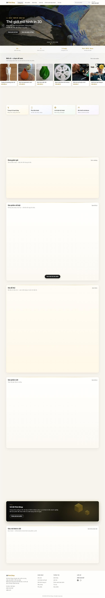

# 3D Print Shop — Quản lý bán hàng in 3D (Laravel)

Hệ thống cửa hàng in 3D + CMS admin + bán hàng QR + module **chuẩn bị thuế HKD**.

| Phần | Mô tả |
|------|--------|
| **Cửa hàng** | Sản phẩm, tin tức, chat, đặt hàng liên hệ |
| **Admin CMS** | SP, kho NL, thiết bị, banner, bài viết, user RBAC |
| **Bán QR** | Quét mã, khách + giao hàng, in phiếu thermal |
| **Thuế HKD** | Hồ sơ, sổ doanh thu, báo cáo kỳ, xuất CSV (không e-filing) |
| **REST API** | `/api/v1` + Sanctum cho mobile |

## Tài liệu

- **Hướng dẫn đầy đủ + ảnh chụp màn hình & ảnh SP:** [docs/guide/HUONG-DAN-SU-DUNG.md](docs/guide/HUONG-DAN-SU-DUNG.md)
- **REST API:** [docs/API.md](docs/API.md)
- **Thiết kế app mobile admin (Android + iOS):** [docs/mobile/THIET-KE-APP-ADMIN.md](docs/mobile/THIET-KE-APP-ADMIN.md)

### Ảnh minh họa nhanh



| Sản phẩm demo | |
|---------------|--|
|  |  |
|  |  |

## Yêu cầu

- PHP 8.1+
- Composer
- MySQL 8

## Cài đặt

```bash
git clone https://github.com/donkma93/3dprintshop.git
cd 3dprintshop
composer install
copy .env.example .env
php artisan key:generate
# chỉnh DB trong .env
php artisan storage:link
php artisan migrate --seed
php artisan serve
```

## Truy cập

| Trang | URL |
|-------|-----|
| Cửa hàng | http://127.0.0.1:8000 |
| Đăng nhập admin | http://127.0.0.1:8000/admin/login |

**Tài khoản seed**

| Vai trò | Email | Mật khẩu |
|---------|-------|----------|
| super_admin | `admin@3dshop.local` | `admin@123` |
| manager | `manager@3dshop.local` | `manager@123` |
| staff | `staff@3dshop.local` | `staff@123` |
| content | `content@3dshop.local` | `content@123` |

## Module quản trị

- **Sản phẩm** — SKU, QR, giá/vốn, tồn, ảnh, SEO, giảm giá
- **Danh mục / NL / nhập kho / thiết bị**
- **CMS** — banner, bài viết, trang tĩnh, cài đặt SEO
- **Chat & yêu cầu đặt hàng**
- **Bán QR** — scan, lịch sử, phiếu gửi 58/80mm/A5/A4
- **Doanh thu** — lãi lỗ (super_admin)
- **Thuế HKD** — hồ sơ, sổ, khóa kỳ, CSV (super_admin)

## Công nghệ

- Laravel 10 · MySQL · Bootstrap 5 (CDN) · Sanctum

## License

Dự án riêng — sử dụng theo thỏa thuận chủ repo.
