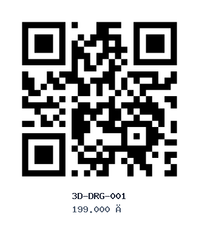
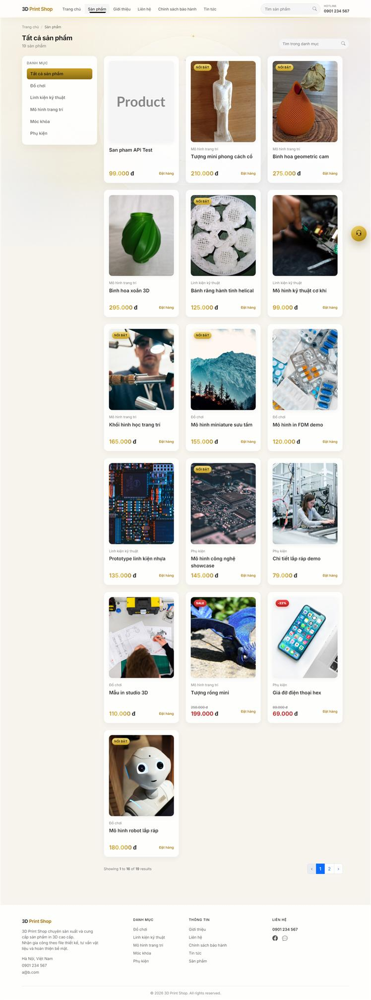
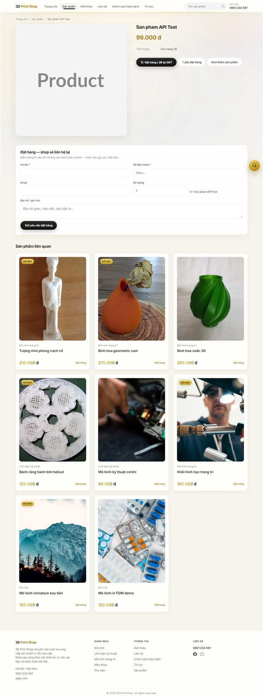
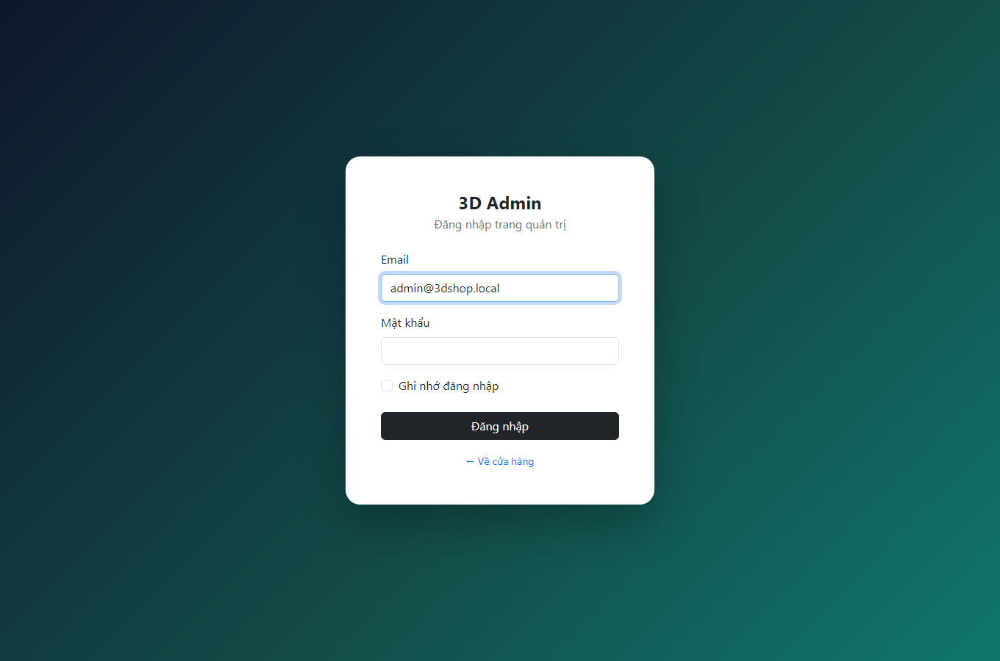
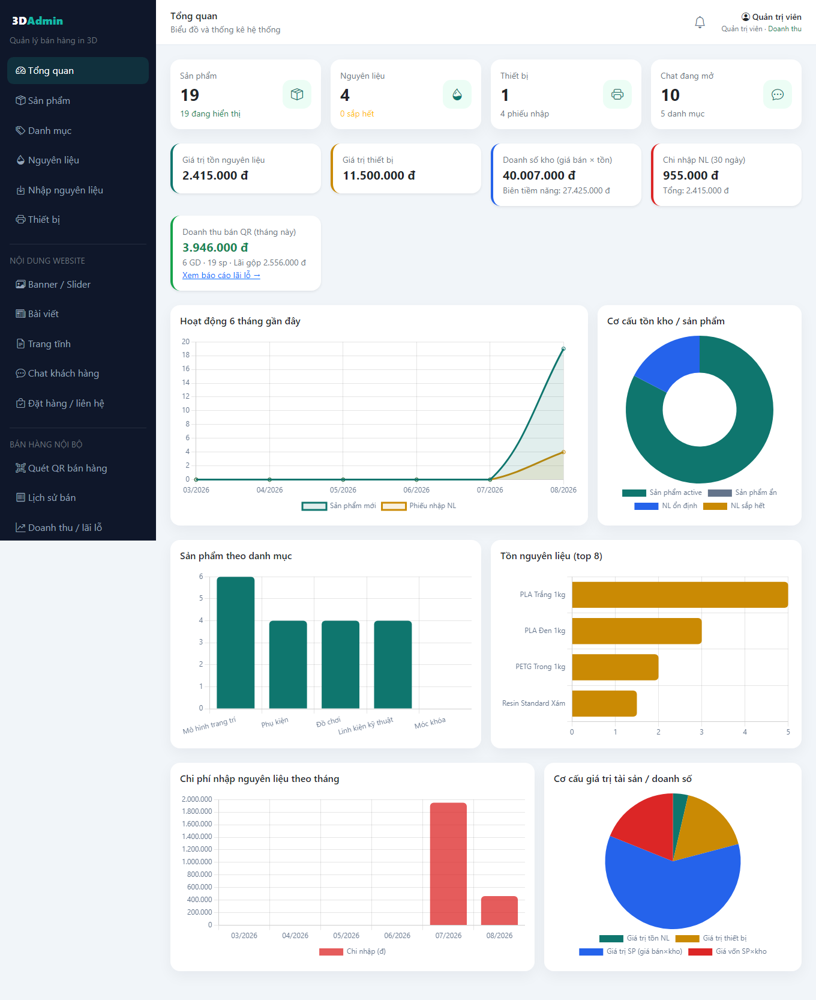
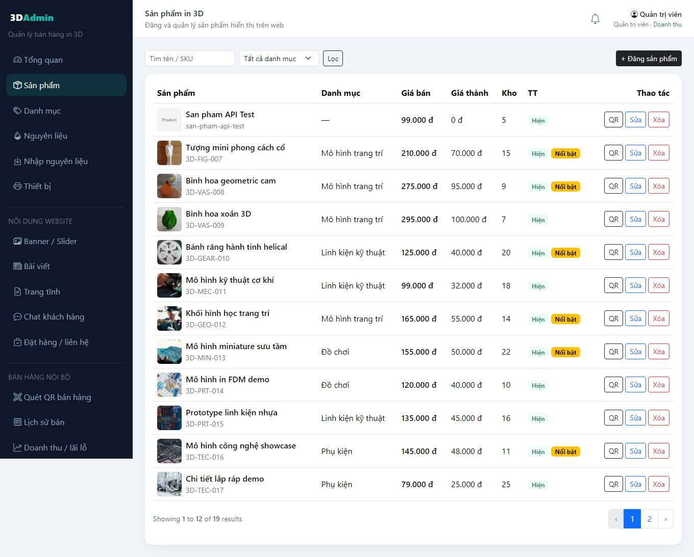
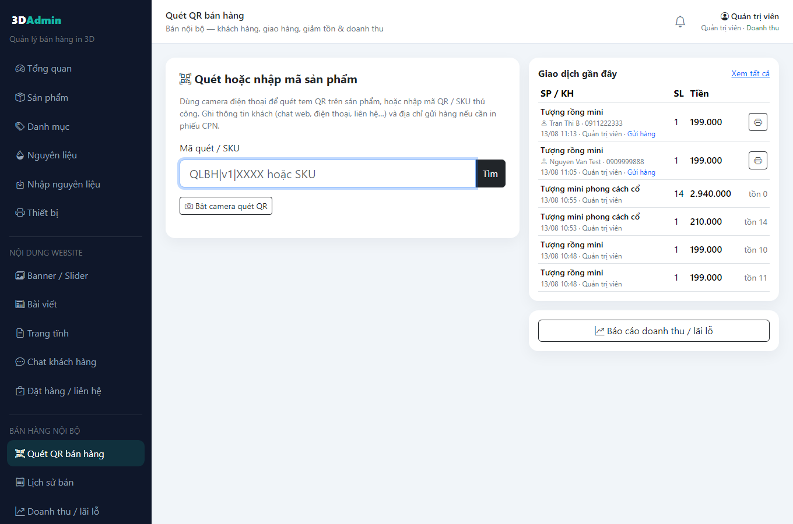
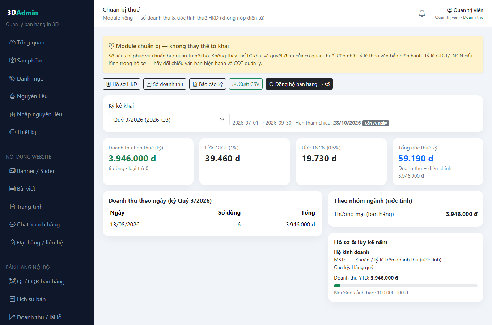
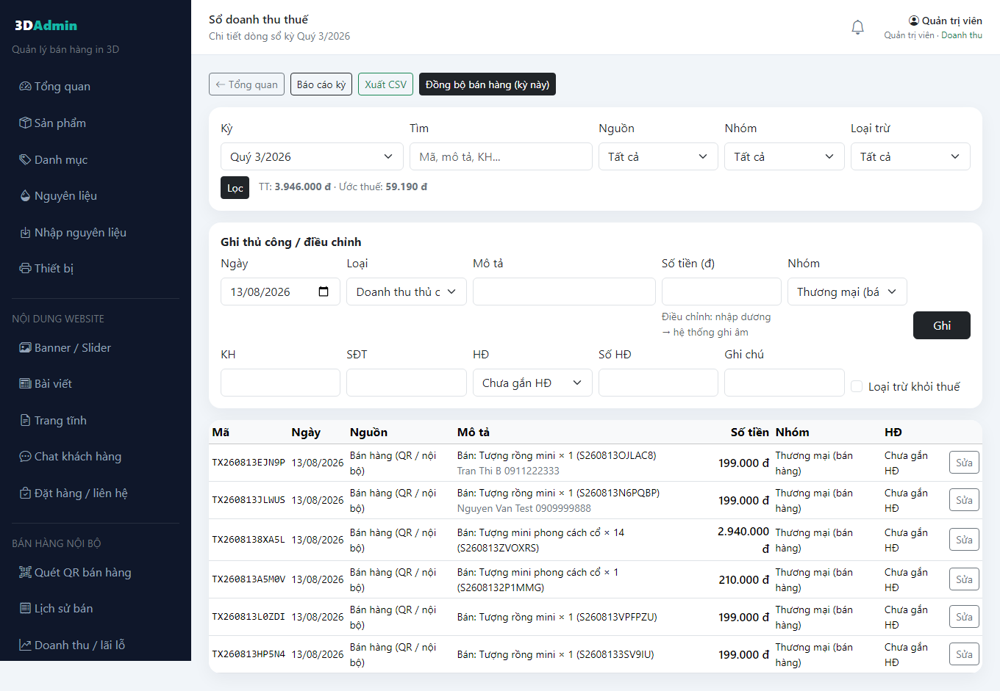

# Hướng dẫn sử dụng — Cửa hàng in 3D (3D Print Shop)

Tài liệu này mô tả cách cài đặt, vận hành cửa hàng web, quản trị bán hàng QR, và module **chuẩn bị thuế hộ kinh doanh**.  
Ảnh minh họa lấy từ dữ liệu demo sản phẩm và giao diện admin.

> **Repo:** [https://github.com/donkma93/3dprintshop](https://github.com/donkma93/3dprintshop)

---

## 1. Tổng quan hệ thống

| Phần | Mô tả |
|------|--------|
| **Cửa hàng (Shop)** | Trang chủ, danh mục, chi tiết sản phẩm, tin tức, chat, đặt hàng liên hệ |
| **Admin CMS** | Sản phẩm, kho NL, thiết bị, banner, bài viết, chat, yêu cầu đặt hàng |
| **Bán hàng QR** | Quét mã QR nội bộ, ghi nhận bán, KH + giao hàng, in phiếu gửi thermal |
| **Thuế HKD (chuẩn bị)** | Hồ sơ, sổ doanh thu, báo cáo kỳ, khóa sổ, xuất CSV — **không** nộp điện tử |
| **REST API** | `/api/v1` cho app mobile (Sanctum) |

### Ảnh sản phẩm demo (catalog)

Các mẫu in 3D dùng trong seed / mock:

| Sản phẩm | Ảnh |
|----------|-----|
| Rồng / mô hình trang trí |  |
| Lọ hoa in 3D |  |
| Bánh răng helical |  |
| Giá đỡ điện thoại |  |
| Mô hình mini |  |
| Robot / đồ chơi |  |

### Banner / slider cửa hàng


### Mẫu nhãn QR sản phẩm



### Ảnh chụp giao diện (screenshot)

**Cửa hàng — trang chủ**


**Cửa hàng — danh sách sản phẩm**



**Cửa hàng — chi tiết sản phẩm**



**Admin — đăng nhập**



**Admin — tổng quan**



**Admin — danh sách sản phẩm**



**Admin — quét QR bán hàng**



**Admin — module chuẩn bị thuế**



**Admin — sổ doanh thu thuế**



---

## 2. Yêu cầu môi trường

- PHP **8.1+**
- Composer 2
- MySQL **8** (hoặc MariaDB tương đương)
- Tiện ích PHP: `pdo_mysql`, `mbstring`, `openssl`, `tokenizer`, `xml`, `ctype`, `json`, `fileinfo`, `gd` (khuyến nghị cho ảnh/QR)
- Node.js (tuỳ chọn — chỉ khi build asset Vite; project hiện dùng Bootstrap CDN)

---

## 3. Cài đặt nhanh

```bash
git clone https://github.com/donkma93/3dprintshop.git
cd 3dprintshop
composer install
copy .env.example .env   # Windows
# hoặc: cp .env.example .env
php artisan key:generate
```

Chỉnh `.env`:

```env
APP_NAME="3D Print Shop"
APP_URL=http://127.0.0.1:8000

DB_CONNECTION=mysql
DB_HOST=127.0.0.1
DB_PORT=3306
DB_DATABASE=quanlybanhang
DB_USERNAME=root
DB_PASSWORD=your_password
```

Tiếp tục:

```bash
php artisan storage:link
php artisan migrate --seed
php artisan serve
```

| Trang | URL |
|-------|-----|
| Cửa hàng | http://127.0.0.1:8000 |
| Admin login | http://127.0.0.1:8000/admin/login |

### Tài khoản seed mặc định

| Vai trò | Email | Mật khẩu |
|---------|-------|----------|
| Quản trị viên (`super_admin`) | `admin@3dshop.local` | `admin@123` |
| Quản lý | `manager@3dshop.local` | `manager@123` |
| Nhân viên | `staff@3dshop.local` | `staff@123` |
| Biên tập | `content@3dshop.local` | `content@123` |

> Đổi mật khẩu ngay trên môi trường thật.

---

## 4. Phân quyền admin

Cấu hình: `config/permissions.php`

| Vai trò | Quyền chính |
|---------|-------------|
| **super_admin** | Toàn quyền (`*`), gồm doanh thu, user, thuế |
| **manager** | Vận hành SP/kho/chat/đơn/bán QR — **không** xem doanh thu, user, thuế |
| **staff** | SP, NL, nhập kho, chat, đơn, bán QR |
| **content** | Banner, bài viết, trang tĩnh, chat |

Quyền đặc biệt:

- `revenue.view` — báo cáo lãi lỗ bán hàng  
- `tax.manage` — module chuẩn bị thuế HKD  
- `sales.sell` — quét QR & lịch sử bán  

---

## 5. Cửa hàng (khách)

1. Mở trang chủ → xem banner, danh mục, sản phẩm nổi bật.  
2. Vào **Sản phẩm** → lọc theo danh mục / tìm kiếm.  
3. Chi tiết SP: giá, giảm giá (nếu có), thông số in, form **đặt hàng / để lại SĐT**.  
4. **Tin tức**, trang tĩnh (Giới thiệu, Liên hệ…).  
5. **Chat** góc trang: khách để lại tin nhắn, admin trả lời realtime (poll).

---

## 6. Quản trị nội dung & kho

Đăng nhập admin → menu bên trái.

### 6.1. Sản phẩm

- Tạo/sửa: tên, SKU (auto theo prefix danh mục), giá, giá vốn, tồn, trọng lượng, ảnh, SEO.  
- Giảm giá theo % hoặc số tiền (nếu đã bật).  
- **QR sản phẩm**: xem / tải / regenerate; in nhãn dán kho.

### 6.2. Danh mục, nguyên liệu, nhập kho, thiết bị

- Danh mục gắn `sku_prefix` để sinh mã SP.  
- Nguyên liệu (PLA, ABS…): tồn + đơn giá.  
- Phiếu nhập: cộng tồn tự động.  
- Thiết bị: máy in / phụ trợ đã mua.

### 6.3. CMS website

- Banner / slider  
- Bài viết  
- Trang tĩnh  
- Cài đặt & SEO (logo, meta, hotline, địa chỉ shipper…)

### 6.4. Chat & yêu cầu đặt hàng

- Chat: danh sách hội thoại, trả lời, đóng/mở.  
- Đặt hàng / liên hệ: trạng thái xử lý, ghi chú nội bộ.

---

## 7. Bán hàng bằng QR (nội bộ)

Menu **Bán hàng nội bộ** (cần `sales.sell`).

### 7.1. Quét / bán

1. Vào **Quét QR bán hàng**.  
2. Quét mã (camera / dán payload / nhập SKU).  
3. Chọn số lượng, (tuỳ chọn) chỉnh giá.  
4. Nhập **thông tin khách** (tên, SĐT, nguồn: walk-in / web chat / phone…).  
5. Nếu giao hàng: bật gửi hàng → địa chỉ cấu trúc (đường, phường, quận, tỉnh, postal), hãng VC, COD, cân nặng.  
6. Xác nhận bán → tồn giảm, lưu `product_sales`, (nếu bật) mở **in phiếu gửi**.

### 7.2. Lịch sử & in phiếu

- **Lịch sử bán**: tìm theo mã / KH / ngày.  
- **In phiếu**: layout thermal **58mm / 80mm / A5 / A4** — kích thước mm cố định, không scale fit-to-page.

### 7.3. Doanh thu / lãi lỗ

Chỉ `super_admin` (`revenue.view`):

- Doanh thu SP, giá vốn, lãi gộp, chi nhập NL, lãi vận hành ước tính theo kỳ.

---

## 8. Module chuẩn bị thuế HKD

Menu **Thuế HKD (chuẩn bị)** — quyền `tax.manage` (mặc định super_admin).

> **Lưu ý pháp lý:** module chỉ hỗ trợ **sổ nội bộ / ước tính / xuất file**. Không thay tờ khai CQT, không nộp điện tử. % GTGT/TNCN do bạn cấu hình theo văn bản hiện hành.

### 8.1. Hồ sơ HKD

`/admin/tax/profile`

- Tên hộ, chủ hộ, MST, CCCD, địa chỉ, ngành nghề, CQT.  
- Phương pháp: khoán/tỷ lệ trên DT (presumptive) hoặc kê khai (chuẩn bị sau).  
- Chu kỳ: tháng / quý / năm.  
- % GTGT, % TNCN (mặc định demo: 1% + 0.5% thương mại).  
- Ngưỡng doanh thu cảnh báo / năm.  
- Ngày hạn tham chiếu (offset tháng sau kỳ).

### 8.2. Tổng quan thuế

`/admin/tax`

- Chọn kỳ (`2026-Q3`, `2026-08`, `2026`…).  
- Doanh thu tính thuế, ước GTGT / TNCN / tổng.  
- Cảnh báo **ngưỡng 80%** lũy kế năm.  
- Cảnh báo **hạn nộp** (số ngày còn lại / quá hạn).  
- Nút **Đồng bộ bán hàng → sổ**.

### 8.3. Sổ doanh thu

`/admin/tax/ledger`

- Đồng bộ từ `product_sales` (không trùng, bỏ qua kỳ đã khóa).  
- Ghi thủ công / điều chỉnh (điều chỉnh dương → lưu âm).  
- Loại trừ dòng khỏi thuế (test).  
- Gắn trạng thái / số hóa đơn.  
- Lọc theo nguồn, nhóm ngành, tìm kiếm.

### 8.4. Báo cáo kỳ & khóa sổ

`/admin/tax/report`

- Snapshot chỉ tiêu kỳ.  
- **Khóa sổ**: chặn ghi/sửa ngày trong kỳ.  
- **Mở lại** khi cần chỉnh.  
- Ghi nhận **đã nộp** (số tiền, ngày, mã tham chiếu).  
- In HTML + **xuất CSV** (`/admin/tax/export`).

### 8.5. API thuế (mobile)

Base: `/api/v1/admin/tax/...` + Bearer token.  
Chi tiết: [docs/API.md](../API.md) mục *Module chuẩn bị thuế HKD*.

---

## 9. REST API (tóm tắt)

Base: `{APP_URL}/api/v1`

1. `POST /admin/login` → token Sanctum  
2. Header: `Authorization: Bearer {token}`  
3. Public: `/home`, `/products`, `/orders`, `/chat`…  
4. Admin: CRUD CMS, sales, tax, users…

Xem đầy đủ: [docs/API.md](../API.md).

---

## 10. Cấu trúc thư mục quan trọng

```
app/
  Http/Controllers/Admin/     # Web admin
  Http/Controllers/Api/       # REST
  Models/                     # Product, ProductSale, Tax*
  Services/                   # ProductSaleService, TaxPreparationService
config/permissions.php        # RBAC
docs/
  API.md
  guide/
    HUONG-DAN-SU-DUNG.md      # File này
    images/                   # Ảnh minh họa sản phẩm
resources/views/
  admin/                      # Blade admin
  shop/                       # Blade cửa hàng
routes/web.php
routes/api.php
```

---

## 11. Checklist vận hành hàng ngày

1. In / dán nhãn QR sản phẩm kho.  
2. Bán qua **Quét QR** (đủ KH + địa chỉ nếu ship).  
3. In phiếu gửi đúng khổ máy nhiệt.  
4. Cuối ngày/tuần: **Đồng bộ sổ thuế** (hoặc tự sync khi bán).  
5. Cuối quý: rà hồ sơ % thuế → **Báo cáo kỳ** → khóa sổ → xuất CSV / in → kê khai ngoài hệ thống.  
6. Sao lưu DB định kỳ.

---

## 12. Xử lý lỗi thường gặp

| Hiện tượng | Cách xử lý |
|------------|------------|
| Ảnh SP / QR 404 | `php artisan storage:link` |
| 403 admin | Kiểm tra `role` + `config/permissions.php` |
| Không đủ tồn khi bán | Nhập kho / chỉnh `stock` SP |
| Kỳ thuế không ghi được | Kỳ đã **khóa sổ** → mở lại hoặc ghi ngày ngoài kỳ |
| Token API 401 | Login lại, tạo token mới |

---

## 13. Ghi chú phát triển

- Stack: **Laravel 10**, Bootstrap 5, Sanctum, SoftDeletes.  
- Module thuế **tách biệt** (bảng `tax_*`, service riêng) để mở rộng e-invoice / e-filing sau.  
- Không commit `.env`, `vendor/`, `node_modules/`.

---

## 14. Liên hệ / repo

- GitHub: https://github.com/donkma93/3dprintshop  
- Tài liệu API: `docs/API.md`  
- Ảnh hướng dẫn: `docs/guide/images/`

*Tài liệu kèm ảnh sản phẩm demo. Cập nhật khi bổ sung module mới.*
