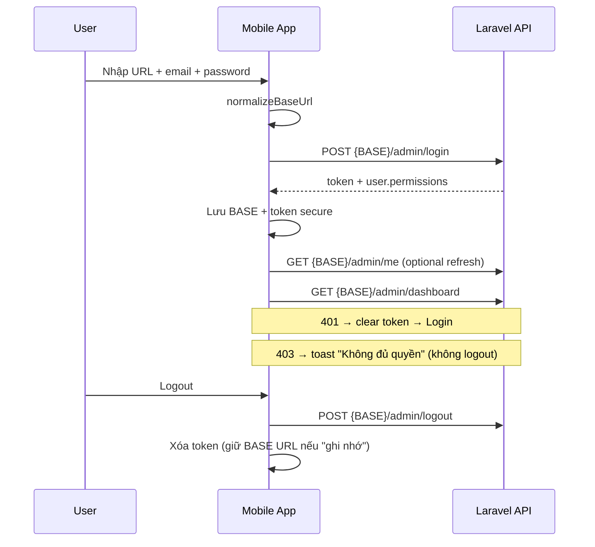
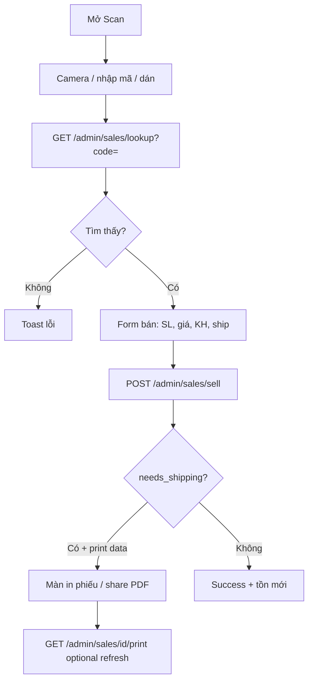

# Thiết kế App Mobile Admin — 3D Print Shop

**Mục tiêu:** Ứng dụng quản trị di động (Android + iOS) gọi REST API admin hiện có (`/api/v1/admin/*`), **không** hard-code server: người dùng nhập **URL API** trước khi đăng nhập; URL đó trở thành **BASE** cho mọi request sau.

**Repo backend:** Laravel Sanctum · envelope JSON chuẩn · RBAC theo `permissions`.

**Tài liệu API tham chiếu:** [docs/API.md](../API.md)

---

## 1. Tóm tắt sản phẩm

| Hạng mục | Quyết định |
|----------|------------|
| Nền tảng | Android + iOS (một codebase) |
| Đối tượng | Nhân viên / quản lý / super_admin của **cùng** hệ thống web admin |
| Phạm vi | Toàn bộ module admin đã có API (không làm app khách hàng storefront) |
| Auth | Email + mật khẩu → Bearer token Sanctum |
| Multi-tenant nhẹ | Mỗi cài đặt app trỏ 1 shop qua BASE URL người dùng nhập |
| Offline | Ưu tiên online; cache danh sách nhẹ; bán QR cần mạng |

### 1.1. Stack khuyến nghị

| Lựa chọn | Công nghệ | Lý do |
|----------|-----------|--------|
| **Khuyến nghị** | **Flutter 3 + Dart** | 1 codebase, camera/QR mature, in nhiệt/share ổn, release store rõ |
| Thay thế | React Native (Expo) | Team JS quen; QR/in cần native module |
| Thay thế | Kotlin Multiplatform + Compose | Chi phí cao hơn, chỉ khi team Kotlin mạnh |

**Các package Flutter gợi ý (lớp thiết kế, không khóa phiên bản):**

- HTTP: `dio` (+ interceptors)
- State: `riverpod` hoặc `bloc`
- Route: `go_router`
- Secure storage: `flutter_secure_storage` (token)
- Prefs: `shared_preferences` (BASE URL, profile cache)
- QR scan: `mobile_scanner`
- Ảnh: `image_picker`, `cached_network_image`
- In / share phiếu: `printing` / `share_plus` + PDF hoặc layout widget
- Local DB (tuỳ giai 2): `drift` / `hive` cho draft sell / offline queue

---

## 2. Luồng đăng nhập & BASE URL (yêu cầu cốt lõi)

### 2.1. Màn hình Login

```
┌─────────────────────────────────────┐
│  3D Print Shop — Admin              │
│                                     │
│  URL API *                          │
│  [ https://shop.example.com/api/v1 ]│
│  gợi ý: không bắt buộc /api/v1      │
│  (app tự chuẩn hóa)                 │
│                                     │
│  Email *                            │
│  [ admin@...                        ]│
│                                     │
│  Mật khẩu *                         │
│  [ ••••••••                         ]│
│                                     │
│  [ ] Ghi nhớ URL trên máy này       │
│                                     │
│        [ Đăng nhập ]                │
│                                     │
│  Lịch sử server gần đây (chips)     │
└─────────────────────────────────────┘
```

### 2.2. Chuẩn hóa BASE URL

Người dùng có thể nhập nhiều dạng; app **normalize** trước khi lưu:

| Input người dùng | BASE lưu lại |
|------------------|--------------|
| `https://shop.com` | `https://shop.com/api/v1` |
| `https://shop.com/` | `https://shop.com/api/v1` |
| `https://shop.com/api` | `https://shop.com/api/v1` |
| `https://shop.com/api/v1` | `https://shop.com/api/v1` |
| `https://shop.com/api/v1/` | `https://shop.com/api/v1` |
| `http://192.168.1.10:8000` | `http://192.168.1.10:8000/api/v1` |

**Thuật toán (pseudo):**

```
function normalizeBaseUrl(raw):
  s = trim(raw)
  if empty → error
  if not starts with http:// or https:// → prepend https://
  strip trailing /
  if ends with /api/v1 → return s
  if ends with /api → return s + "/v1"
  return s + "/api/v1"
```

**Kiểm tra URL (optional, UX tốt):**

- `GET {BASE}/settings` (public) trước login → xác nhận server sống + HTTPS warning nếu production.
- Hoặc chỉ gọi login; lỗi DNS/timeout hiển thị rõ “Không kết nối được server”.

### 2.3. Login API

```
POST {BASE}/admin/login
Content-Type: application/json
Accept: application/json

{
  "email": "...",
  "password": "...",
  "device_name": "ios-iphone15" | "android-pixel-8" | model từ device_info
}
```

**Thành công:** lưu

| Key | Storage | Nội dung |
|-----|---------|----------|
| `api_base_url` | SharedPreferences | BASE đã normalize |
| `recent_bases` | SharedPreferences | list tối đa 5 URL gần đây |
| `access_token` | SecureStorage | `data.token` |
| `token_type` | SecureStorage / prefs | `Bearer` |
| `user_json` | SecureStorage hoặc prefs | user + `permissions` + `can_view_revenue` + `role` |

**Header mọi request admin sau đó:**

```
Authorization: Bearer {token}
Accept: application/json
```

### 2.4. Session lifecycle



- **Cold start:** có token + BASE → `GET /admin/me`; 200 vào Home; 401 về Login (giữ URL).
- **Đổi server:** nút “Đổi URL API” trên Login hoặc Settings → xóa token, giữ form URL editable.
- **Logout all devices:** Settings → gọi `POST /admin/logout-all` (cảnh báo).

---

## 3. Kiến trúc ứng dụng

```
lib/
  main.dart
  app.dart
  core/
    config/          # env flavor (dev) — không hardcode shop URL
    network/
      api_client.dart      # Dio + BASE dynamic
      api_envelope.dart    # parse success/message/data/meta
      auth_interceptor.dart
      error_mapper.dart
    storage/
      secure_store.dart
      prefs_store.dart
    permissions/
      permission_guard.dart  # can('sales.sell')
    theme/
    widgets/         # Empty, Error, MoneyText, PermissionGate
  features/
    auth/
    dashboard/
    products/
    categories/
    materials/
    material_inputs/
    equipment/
    sales/           # scan, sell form, history, print, report
    orders/
    chat/
    cms/             # banners, posts, pages
    settings/
    trash/
    users/
    tax/
  router/
    app_router.dart  # deep links optional
```

### 3.1. ApiClient (trái tim multi-server)

```dart
// Ý tưởng thiết kế
class ApiClient {
  late Dio _dio;
  String? _baseUrl;

  void setBaseUrl(String normalizedBase) {
    _baseUrl = normalizedBase;
    _dio.options.baseUrl = normalizedBase; // e.g. https://x.com/api/v1
  }

  Future<void> setToken(String? token) { ... }

  // path luôn relative: '/admin/products'
  Future<ApiResponse<T>> get(...);
  Future<ApiResponse<T>> post(...);
  Future<ApiResponse<T>> put(...);
  Future<ApiResponse<T>> delete(...);
  Future<ApiResponse<T>> upload(...); // multipart
}
```

- **Không** inject BASE compile-time cho shop thật.
- Flavor chỉ dùng cho analytics / Sentry DSN app vendor, không phải shop URL.

### 3.2. Envelope chuẩn

```dart
class ApiResponse<T> {
  final bool success;
  final String message;
  final T? data;
  final Meta? meta;
  final Map<String, dynamic>? errors; // validation 422
}
```

Map HTTP:

| Status | Hành vi app |
|--------|-------------|
| 200/201 | parse `data` |
| 401 | clear session → Login |
| 403 | snackbar message API |
| 422 | field errors form |
| 404/5xx | error screen / retry |
| Network | “Kiểm tra mạng / URL API” |

### 3.3. Phân quyền UI

Ẩn / chặn theo `user.permissions` (và `can_view_revenue`):

| Permission | Module app |
|------------|------------|
| `dashboard.view` | Tổng quan |
| `products.manage` | Sản phẩm + QR |
| `categories.manage` | Danh mục |
| `materials.manage` | Nguyên liệu |
| `material_inputs.manage` | Nhập NL |
| `equipment.manage` | Thiết bị |
| `banners.manage` | Banner |
| `posts.manage` | Bài viết |
| `pages.manage` | Trang tĩnh |
| `chat.manage` | Chat |
| `orders.manage` | Đặt hàng / liên hệ |
| `sales.sell` | Quét QR, lịch sử bán, in phiếu |
| `revenue.view` | Báo cáo lãi lỗ, số tiền nhạy cảm |
| `tax.manage` | Module thuế |
| `settings.manage` | Cài đặt shop |
| `trash.manage` | Thùng rác |
| `users.manage` | Người dùng + roles |

`PermissionGate(permission: 'tax.manage', child: ...)`  
Menu bottom / drawer **chỉ render** mục user có quyền.

---

## 4. Bản đồ màn hình ↔ API

### 4.1. Shell điều hướng

**Bottom navigation (mobile-first)** — 5 slot ưu tiên vận hành:

1. **Tổng quan** (`dashboard.view`)
2. **Bán hàng** (`sales.sell`) — hub: Scan / Lịch sử / (Báo cáo nếu revenue)
3. **Chat** (`chat.manage`) + badge poll
4. **Kho / SP** (`products` | `materials`…) — tab con hoặc secondary hub
5. **Thêm** — drawer: đơn hàng, CMS, thuế, settings, users, trash, đăng xuất

Tablet (iPad): NavigationRail + master-detail.

### 4.2. Auth

| Màn | API |
|-----|-----|
| Login | `POST /admin/login` |
| Splash session | `GET /admin/me` |
| Logout | `POST /admin/logout` |
| Logout all | `POST /admin/logout-all` |

### 4.3. Dashboard

| UI | API |
|----|-----|
| Cards stats, charts | `GET /admin/dashboard` |
| Ẩn tiền nếu `!can_view_revenue` | dùng flag response |

### 4.4. Sản phẩm

| UI | API |
|----|-----|
| List + search + filter category | `GET /admin/products?q=&category_id=&is_active=&page=` |
| Chi tiết / form tạo-sửa | `GET/POST/PUT /admin/products`, `DELETE` |
| Next SKU | `GET /admin/products/next-sku?category_id=` |
| QR xem / regenerate / share ảnh | `GET .../qr`, `POST .../qr/regenerate`, download URL |
| Upload ảnh | multipart `POST/PUT` giống web |

### 4.5. Danh mục, NL, nhập kho, thiết bị

CRUD `apiResource` tương ứng:

- `/admin/categories`
- `/admin/materials` (+ `low_stock=1`)
- `/admin/material-inputs`
- `/admin/equipment`

Tiền (`cost_price`, `purchase_price`, …): chỉ hiển thị khi `can_view_revenue`.

### 4.6. Bán hàng QR (flow chính trên mobile)



| UI | API |
|----|-----|
| Lookup | `GET /admin/sales/lookup?code=` |
| Bán | `POST /admin/sales/sell` (body đầy đủ như API.md) |
| Lịch sử | `GET /admin/sales/history?q=&from=&to=&shipping_only=` |
| Chi tiết GD | `GET /admin/sales/{id}` |
| Phiếu gửi | `GET /admin/sales/{id}/print` |
| Báo cáo lãi lỗ | `GET /admin/sales/report?from=&to=` (`revenue.view`) |

**In phiếu:** render layout 58/80mm từ JSON print (sender/receiver/COD) → PDF/image → AirPrint / share Bluetooth printer (OS-dependent). Không cần backend in.

### 4.7. Đơn hàng / liên hệ

| UI | API |
|----|-----|
| List / filter status | `GET /admin/orders` |
| Chi tiết + cập nhật | `GET/PUT /admin/orders/{id}` |
| Xóa soft | `DELETE /admin/orders/{id}` |

### 4.8. Chat admin

| UI | API |
|----|-----|
| List open/closed | `GET /admin/chat?status=` |
| Thread | `GET /admin/chat/{id}` |
| Gửi | `POST /admin/chat/{id}/reply` |
| Typing | `POST .../typing` |
| Poll tin | `GET .../poll?after_id=` mỗi 2–3s khi mở thread |
| Badge global | `GET /admin/chat/notifications?after_id=&with_list=1` mỗi 5–8s (App lifecycle resumed) |
| Đọc | `POST /admin/chat/notifications/read` |
| Đóng / mở | `close` / `reopen` |

Background: phase 1 chỉ poll khi app foreground; phase 2 FCM nếu backend bổ sung push.

### 4.9. CMS

| Module | API |
|--------|-----|
| Banner | `/admin/banners` |
| Posts | `/admin/posts` |
| Pages | `/admin/pages` |
| Settings shop | `GET/PUT/POST /admin/settings` (upload logo multipart) |

### 4.10. Thuế HKD

| UI | API |
|----|-----|
| Tổng quan kỳ | `GET /admin/tax/summary?period=` |
| Chọn kỳ | `GET /admin/tax/periods` |
| Hồ sơ | `GET/PUT /admin/tax/profile` |
| Sổ | `GET /admin/tax/ledger` |
| Ghi dòng | `POST /admin/tax/entries` |
| Sửa / xóa | `PUT/DELETE /admin/tax/entries/{id}` |
| Sync bán | `POST /admin/tax/sync` |
| Khóa / mở / đã nộp | `period/close|reopen|paid` |

Disclaimer UI cố định: “Chỉ chuẩn bị — không nộp điện tử”.

### 4.11. Users & Trash

| UI | API |
|----|-----|
| Roles | `GET /admin/roles` |
| Users CRUD | `/admin/users` |
| Trash list/restore/force/empty | `/admin/trash...` |

---

## 5. Mô hình dữ liệu client (domain)

Không mirror full Eloquent; DTO gọn:

```
Session { baseUrl, token, user }
User { id, name, email, role, roleLabel, permissions[], canViewRevenue }
Product, Category, Material, MaterialInput, Equipment
ProductSale, SalePrintPayload
OrderRequest
ChatConversation, ChatMessage
TaxSummary, TaxLedgerEntry, TaxProfile, TaxPeriod
Banner, Post, Page, SiteSettings
Paginated<T> { items, page, lastPage, total }
```

Money: hiển thị `NumberFormat` vi_VN; lưu `num`/`double` từ API.

---

## 6. UX & UI guidelines

- Ngôn ngữ UI: **Tiếng Việt** (khớp admin web).
- Theme: tối giản, primary gần admin web (`#0f172a` / accent hiện tại).
- Form bán hàng: wizard 2 bước (SP → KH/Ship) tránh 1 màn quá dài.
- Pull-to-refresh list; infinite scroll `page` / `meta`.
- Skeleton loading; empty state có CTA.
- Camera permission copy rõ: “Quét mã QR sản phẩm kho”.
- iOS ATS: shop HTTP chỉ dev; production HTTPS.
- Android: `usesCleartextTraffic` chỉ debug builds nếu test LAN.

---

## 7. Bảo mật

| Rủi ro | Biện pháp |
|--------|-----------|
| Token lộ | Secure storage; không log token |
| MITM | Ưu tiên HTTPS; optional pin cert phase 3 |
| URL độc hại | Chỉ gọi path `/admin/*` trên BASE đã normalize; không open arbitrary webview login |
| Session hijack | Logout; logout-all; token theo `device_name` |
| Screenshot bán hàng | Tuỳ chính sách; flag `FLAG_SECURE` optional màn doanh thu |
| Paste password | Cho phép; không lưu password |
| Deep link | Không auto-login từ URL bên ngoài |

---

## 8. Xử lý lỗi & edge cases

| Tình huống | Xử lý |
|------------|--------|
| BASE sai / server down | Message + nút “Sửa URL” |
| 401 giữa chừng | Dialog session hết hạn → Login |
| 403 module | Ẩn menu; nếu deep-link → màn “Không có quyền” |
| Lookup QR không thấy | Haptic + message API |
| Sell hết tồn | 422 message giữ form |
| Upload ảnh lớn | Compress client trước multipart |
| Period tax locked | Disable form ghi sổ |
| Đổi BASE khi đã login | Force logout + clear token |

---

## 9. Lộ trình triển khai (phased)

### Phase 0 — Nền (1–1.5 tuần)

- Project Flutter, theme, router
- ApiClient + envelope + secure session
- **Login URL + email/password** + normalize BASE
- Splash / me / logout
- PermissionGate + shell menu rỗng

### Phase 1 — Vận hành kho & bán (ưu tiên cao)

- Dashboard
- Products list/detail (read + edit tồn/giá cơ bản)
- **Sales: lookup + sell + history + print**
- Orders list/detail
- Chat list + reply + notification poll

### Phase 2 — Kho & CMS

- Categories, materials, material-inputs, equipment
- Banners, posts, pages (CRUD + upload)
- Settings
- Trash

### Phase 3 — Tài chính & hệ thống

- Sales report (revenue)
- Tax module full
- Users + roles
- Polish print, QR regenerate, offline draft sell (optional)

### Phase 4 — Store release

- Crashlytics / Sentry
- App icon, splash, privacy policy (camera, photo)
- TestFlight + Play internal
- Deep link `3dprintshop://login` optional

---

## 10. Cấu trúc request mẫu (client)

```http
POST https://khachhang-cua-ban.com/api/v1/admin/login
Accept: application/json
Content-Type: application/json

{"email":"admin@3dshop.local","password":"...","device_name":"android-sm-s911"}
```

```http
GET https://khachhang-cua-ban.com/api/v1/admin/sales/lookup?code=SKU001
Authorization: Bearer 12|xxxxx
Accept: application/json
```

App **không** lưu path tuyệt đối đầy đủ trong code feature; chỉ:

```dart
api.get('/admin/sales/lookup', query: {'code': code});
// Dio baseUrl = session.baseUrl
```

---

## 11. Ma trận tính năng × role (gợi ý hiển thị)

| Tính năng | super_admin | manager | staff | content |
|-----------|:-----------:|:-------:|:-----:|:-------:|
| Dashboard | ✓ | ✓ | ✓ | ✓ |
| Bán QR | ✓ | ✓ | ✓ | — |
| Báo cáo DT | ✓ | — | — | — |
| SP / NL / nhập | ✓ | ✓ | ✓ | — |
| Chat | ✓ | ✓ | ✓ | ✓ |
| Orders | ✓ | ✓ | ✓ | — |
| CMS | ✓ | ✓ | — | ✓ |
| Settings | ✓ | — | — | — |
| Users | ✓ | — | — | — |
| Tax | ✓ | — | — | — |

(Khớp `config/permissions.php` backend; app luôn trust `permissions[]` từ API.)

---

## 12. Kiểm thử

| Loại | Nội dung |
|------|----------|
| Unit | `normalizeBaseUrl`, permission map, money format |
| Integration | Mock Dio login → dashboard; 401 interceptor |
| E2E manual | 2 BASE (staging + production), sell + print, chat poll |
| Device | Android 10+, iOS 15+; camera QR light/dark |
| Permission | Đăng nhập staff → không thấy tax/users/revenue |

**Mock server:** có thể trỏ BASE = máy dev `http://LAN:8000/api/v1` khi debug.

---

## 13. Những gì backend đã đủ / có thể bổ sung sau

### Đã đủ cho app admin

- Login token + me + logout  
- CRUD modules + sales + chat + tax + trash + users  
- Envelope thống nhất  
- RBAC path-based  

### Tùy chọn backend sau (không chặn phase 1)

| Nhu cầu app | API bổ sung gợi ý |
|-------------|-------------------|
| Push chat | FCM token register + server push |
| Health | `GET /admin/health` hoặc public `/ping` |
| App version force-update | `GET /admin/app-config` |
| Refresh token dài hạn | hiện Sanctum personal token; có thể TTL config |
| Export tax CSV trên app | Web đã có; app có thể generate CSV client từ ledger |

---

## 14. Wireframe text — luồng ngày làm việc

1. Mở app → đã login → **Tổng quan**  
2. Tab **Bán hàng** → Scan QR trên kệ → điền KH/ship → Bán → In phiếu  
3. Badge **Chat** → trả lời khách  
4. **Đơn hàng** mới từ web → gọi lại KH  
5. Cuối ngày (admin): **Thuế** → Sync → xem summary  

---

## 15. Deliverables khi code app (checklist)

- [ ] Repo Flutter riêng (hoặc monorepo `mobile/`)
- [ ] Login: URL + email + password + normalize BASE
- [ ] Secure token + 401 handling
- [ ] Menu theo permissions
- [ ] Sales scan end-to-end
- [ ] Chat poll
- [ ] README mobile: cách trỏ BASE, build Android/iOS
- [ ] Không hardcode `APP_URL` shop trong binary release

---

## 16. Kết luận thiết kế

App admin mobile là **thin client** của API `/api/v1/admin/*`:

1. **URL API** do người dùng nhập → chuẩn hóa thành `…/api/v1` → BASE toàn app.  
2. **Email/mật khẩu** → Sanctum Bearer → mọi module admin.  
3. **RBAC** từ `user.permissions` / `can_view_revenue` điều khiển UI.  
4. **Flutter** một codebase cho Android & iOS; ưu tiên bán QR + chat + đơn trước, thuế/CMS/users sau.

Khi sẵn sàng implement: tạo project Flutter theo Phase 0–1, bám đúng contract [API.md](../API.md).
